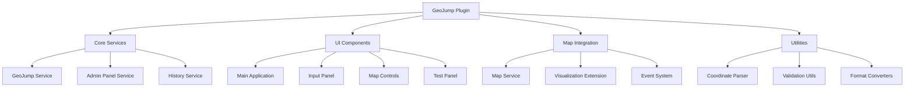

# Design Document

## Overview

The Geojumping feature design builds upon the existing 80-90% complete geojumping plugin implementation. This design focuses on refining, completing, and productionizing the current plugin to meet all requirements. The existing plugin already provides core functionality including coordinate parsing, map integration, and UI components, but needs refinement for production readiness, enhanced place name resolution, and improved user experience.

## Architecture

### Current Architecture Assessment

The existing plugin follows a solid architecture with:
- **Plugin Structure**: Standard OpenSearch Dashboards plugin with proper separation of concerns
- **Map Integration**: Two approaches - original DOM-based and refactored API-based integration
- **Service Layer**: Core geojump functionality abstracted into services
- **Component Layer**: React components for UI and map controls
- **Utility Layer**: Coordinate parsing and validation utilities

### Refined Architecture



## Components and Interfaces

### 1. Enhanced GeoJump Service

**Current State**: Basic coordinate jumping functionality exists
**Refinements Needed**:
- Improve error handling and user feedback
- Add configuration management
- Enhance marker management
- Fix modal interaction bugs

```typescript
interface GeoJumpService {
  // Existing methods to refine
  jumpToCoordinates(coords: Coordinates, options?: JumpOptions): Promise<boolean>;
  
  // New methods to implement
  addTemporaryMarker(coords: Coordinates, options?: MarkerOptions): string;
  removeMarker(markerId: string): void;
  getJumpHistory(): JumpHistoryEntry[];
  clearHistory(): void;
  getConfiguration(): GeoJumpConfig;
  updateConfiguration(config: Partial<GeoJumpConfig>): Promise<void>;
}
```

### 2. Admin Panel Service (New Component)

**Purpose**: Manage plugin configuration and provide diagnostic capabilities
**Integration**: Self-contained service without external dependencies

```typescript
interface AdminPanelService {
  getPluginStatus(): PluginStatus;
  getMapDiagnostics(): MapDiagnostics;
  updateConfiguration(config: Partial<GeoJumpConfig>): Promise<void>;
  resetConfiguration(): Promise<void>;
  exportConfiguration(): string;
  importConfiguration(configJson: string): Promise<void>;
}

interface PluginStatus {
  version: string;
  isActive: boolean;
  mapsDetected: number;
  lastError?: string;
  performance: PerformanceMetrics;
}

interface MapDiagnostics {
  detectedMaps: MapInfo[];
  integrationStatus: IntegrationStatus;
  supportedFeatures: string[];
}
```

### 3. Enhanced UI Components

**Current State**: Basic input panel and map controls exist
**Refinements Needed**:
- Fix modal text input bug (prevent map dragging when highlighting text)
- Improve input validation feedback
- Add coordinate format selection
- Enhance visual design consistency
- Make admin panel fully functional

### 4. Improved Map Integration

**Current State**: Two integration approaches (original and refactored)
**Refinements Needed**:
- Consolidate to the refactored approach
- Add support for additional map types
- Improve marker management
- Add smooth transitions and animations

## Data Models

### Core Data Structures

```typescript
interface Coordinates {
  lat: number;
  lon: number;
  zoom?: number;
}

interface JumpOptions {
  showMarker?: boolean;
  markerDuration?: number;
  animateTransition?: boolean;
  updateExtent?: boolean;
  zoomLevel?: number;
}

interface JumpHistoryEntry {
  id: string;
  coordinates: Coordinates;
  placeName?: string;
  timestamp: Date;
  source: 'coordinates' | 'place';
}

interface MarkerOptions {
  duration?: number;
  style?: MarkerStyle;
  popup?: string;
  persistent?: boolean;
}
```

### Configuration Schema

```typescript
interface GeoJumpConfig {
  defaultZoom: number;
  markerDuration: number;
  enableHistory: boolean;
  maxHistoryEntries: number;
  supportedFormats: CoordinateFormat[];
  enableAnimations: boolean;
  modalInteractionFix: boolean;
}
```

## Error Handling

### Error Categories and Responses

1. **Input Validation Errors**
   - Invalid coordinate format
   - Out-of-range coordinates
   - Empty input

2. **UI Interaction Errors**
   - Modal text input conflicts with map dragging
   - Focus management issues
   - Event propagation problems

3. **Map Integration Errors**
   - No maps available
   - Map instance not accessible
   - Unsupported map type

4. **Configuration Errors**
   - Invalid configuration values
   - Admin panel state inconsistencies
   - Settings persistence failures

### Error Handling Strategy

```typescript
interface GeoJumpError {
  type: 'validation' | 'geocoding' | 'map' | 'network';
  code: string;
  message: string;
  userMessage: string;
  recoverable: boolean;
  suggestions?: string[];
}
```

## Testing Strategy

### Unit Testing

**Current State**: Basic coordinate parser tests exist
**Enhancements Needed**:
- Service layer testing
- Component testing with React Testing Library
- Error handling scenarios
- Edge cases for coordinate parsing

### Integration Testing

**New Requirements**:
- Map integration testing
- Geocoding service integration
- End-to-end user workflows
- Cross-browser compatibility

### Manual Testing

**Current State**: Test panel exists for manual testing
**Enhancements Needed**:
- Comprehensive test scenarios
- Performance testing
- Accessibility testing
- Mobile responsiveness testing

## Implementation Phases

### Phase 1: Core Refinements
- Consolidate to refactored architecture
- Enhance error handling and user feedback
- Improve coordinate parsing robustness
- Add comprehensive input validation

### Phase 2: Admin Panel Enhancement
- Implement fully functional admin panel
- Add configuration management interface
- Add plugin status monitoring
- Add map detection diagnostics

### Phase 3: Enhanced User Experience
- Improve visual design consistency
- Add smooth animations and transitions
- Enhance marker management
- Add configuration options

### Phase 4: Production Readiness
- Comprehensive testing suite
- Performance optimization
- Documentation completion
- Accessibility compliance

## Integration Points

### OpenSearch Dashboards Integration

1. **Plugin Registration**: Standard plugin lifecycle hooks
2. **Application Registration**: Main navigation menu entry
3. **Embeddable Integration**: Dashboard embedding capabilities
4. **Map Visualization Integration**: Automatic control injection

### Map Library Integration

1. **OpenSearch Maps**: Primary integration target
2. **Leaflet**: Fallback integration
3. **Mapbox GL**: Extended support
4. **Custom Maps**: Event-based integration

### Internal Service Integration

1. **Configuration Management**: Local storage and in-memory configuration
2. **Admin Panel**: Self-contained diagnostic and management interface
3. **Modal Interaction**: Event handling improvements for UI conflicts

## Security Considerations

### Input Validation
- Sanitize all user inputs
- Validate coordinate ranges
- Prevent injection attacks

### External API Usage
- Rate limiting for geocoding requests
- API key management
- CORS handling

### Data Privacy
- No persistent storage of sensitive location data
- Optional history with user consent
- Clear data retention policies

## Performance Considerations

### Optimization Strategies
- Debounced autocomplete requests
- Cached geocoding results
- Lazy loading of map integrations
- Efficient marker management

### Monitoring
- Jump success/failure rates
- Response time metrics
- Error frequency tracking
- User interaction analytics

## Accessibility

### WCAG Compliance
- Keyboard navigation support
- Screen reader compatibility
- High contrast mode support
- Focus management

### Usability
- Clear error messages
- Intuitive input formats
- Consistent UI patterns
- Mobile-friendly design